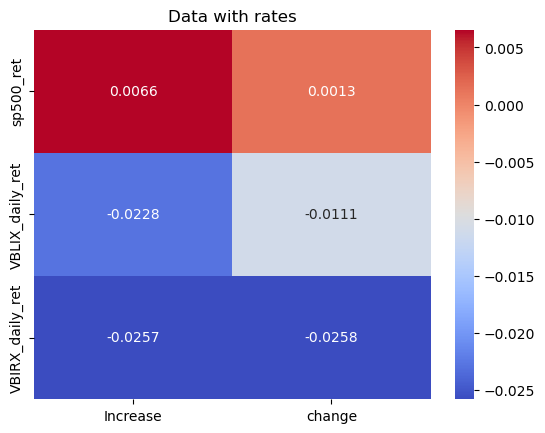
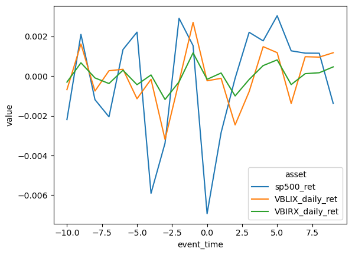
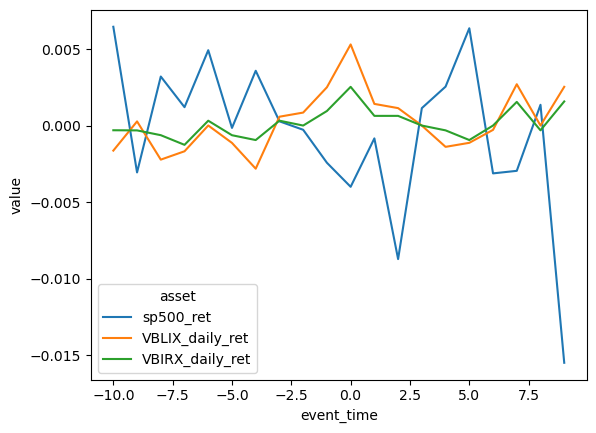

# Welcome to our [team project website!](https://mab923.github.io/finalteamproject)

This is a website to showcase our final project for FIN 377 - Data Science for Finance course at Lehigh University.

The basis for this report was analyzing the connection between the changes in interest rates brought on by FOMC meetings on the stock market and bonds. The project analyzes the S&P 500 as an indicator for stock correlation and the VBIRX and VBILX indexes as bond samples. 

# Hypothesis 

Large increases in interest rates would lead to negative or lower returns in the days before and after an FOMC meeting and vice versa


The final analysis file is [here](https://github.com/mab923/finalteamproject/blob/main/Analysis/Final_Analysis.ipynb)
<br><br>
Final Presentation [here](https://docs.google.com/presentation/d/1FVA0dMcFhYUgkXvHzQWL9D_ouhccAGN5Ac7-nf0jBTs/edit#slide=id.g1b76803da3e_0_5)

Below is a high-level overview of the steps we took during the project. For a more in depth look into the entire project go to our team website here [team project website!](https://mab923.github.io/finalteamproject)


## Table of contents
1. [Introduction](#introduction)
2. [Data Description](#data)
3. [Methodologies](#meth)
    1. [Loading Data](#load)
    2. [Cleaning Data](#clean)
    3. [Merging Data](#merge)
4. [Visualizations](#viz)
5. [Summary](#summary)

## Introduction  <a name="introduction"></a>

Interest rate changes can have large effects on the economy in both the stock and bond market. This project takes a look deeper into how different securities react to changes in the days leading up to and following a FOMC meeting and corresponding hike. The project also takes a look at how the magnitude of a rate change can affect the returns of different stocks and bonds.

## Data Description <a name="data"></a>

We chose to use data from the years 2015 through 2023. We felt this was a large enough sample to draw conclusions from without making the dataset too large. 

In order to properly track the movement of stock price and bond prices we chose the following securities to track:
- Federal Open Market Committee (FOMC)
- S&P 500 - indicator for stock correlation
- Vanguard Intermediate Long-Term Bond Index Fund (VBILX) -bond sample
- Vanguard Short-Term Bond Index Fund Admiral Shares (VBIRX) - bond sample

The two bond indexes were chosen due to their relatively stable returns and low risk metrics. The two bonds indexes would cover the correlation between bonds and rate hikes for our analysis

The S&P 500 was the logical choice for tracking the stock market due to the high variety in sector, industry, and size of the companies in the index.

The FOMC dataset was used to collect the different rate hikes that occurred over the period of 2015-2023

To see the collection of datasets used (raw/clean/final) click [here](https://github.com/mab923/finalteamproject/tree/main/inputs)


## Methodologies <a name="meth"></a>


### Loading Data <a name="load"></a>
The datasets were luckily able to be accessed online and found without importing using a function like yfinance. The raw datasets were loaded using pandas. The raw datasets are located in the inputs folder

### Cleaning Data <a name="clean"></a>
A thorough EDA was done to ensure there were no missing variables or extreme outliers. VIsualizations were also utilized to understand the data.
For more information on the detailed EDA look at the team website

## Merging and Creating Variables Section <a name="merge"></a>
created a variable for the time index of rate changes, a categorical variable displaying if a change in rate was an increase or decrease, and a column depicting the magnitude of rate change.

## Visualizations <a name='viz'></a>

Here are some graphs that we created in our analysis. All of the visualization can be found [here](https://github.com/mab923/finalteamproject/tree/main/pics)


<br><br>
This correlation matrix displays the correlation coefficients between the variables we created in our EDA process. The S&P 500 returns are especially interesting as they indicate a strong positive correlation between an interest rate hike and returns of the index.
<br><br>

<br><br>
This graph depicts the returns of our 3 chosen securities after an interest rate hike. The time variable on the bottom depicts the days leading up to the rate change and the days following. Very interesting results as there is a sharp increase right after the announcement of an increase in rates

<br><br>

<br><br>
This graph is similar to the one above but depicts the returns after a decrease in interest rates. Similar feeling as the last graph as there are some mixed findings here. The pattern is slightly closer to what we expected
<br><br>


## Summary <a name="summary"></a>

Our hypothesis was both challenged and supported by our findings in this project. The correlation matrix offered some support to our hypothesis but also was surprising with its correlation of the S&P 500 returns. Similarly, the return graphs showed some semblance of a pattern with returns and rates, but not necessarily the one that we predicted. We suspect that more variables and indexes would have to be chosen for the experiment to show some real results if it were to be done again.


## About the team

<br>
Nathan is a senior at Lehigh studying finance and business analytics.
<br><br><br>

<br>
Margaux is a senior at Lehigh studying Finance 
<br><br><br>

<br>
Isabel is a senior at Lehigh studying finance and business analytics.


## Collection of imports needed

```python
import pandas as pd
import numpy as np
import seaborn as sns
import matplotlib.pyplot as plt
import statsmodels.formula.api as smf
from tqdm import tqdm
import glob
import os
from time import sleep
import fnmatch
```
